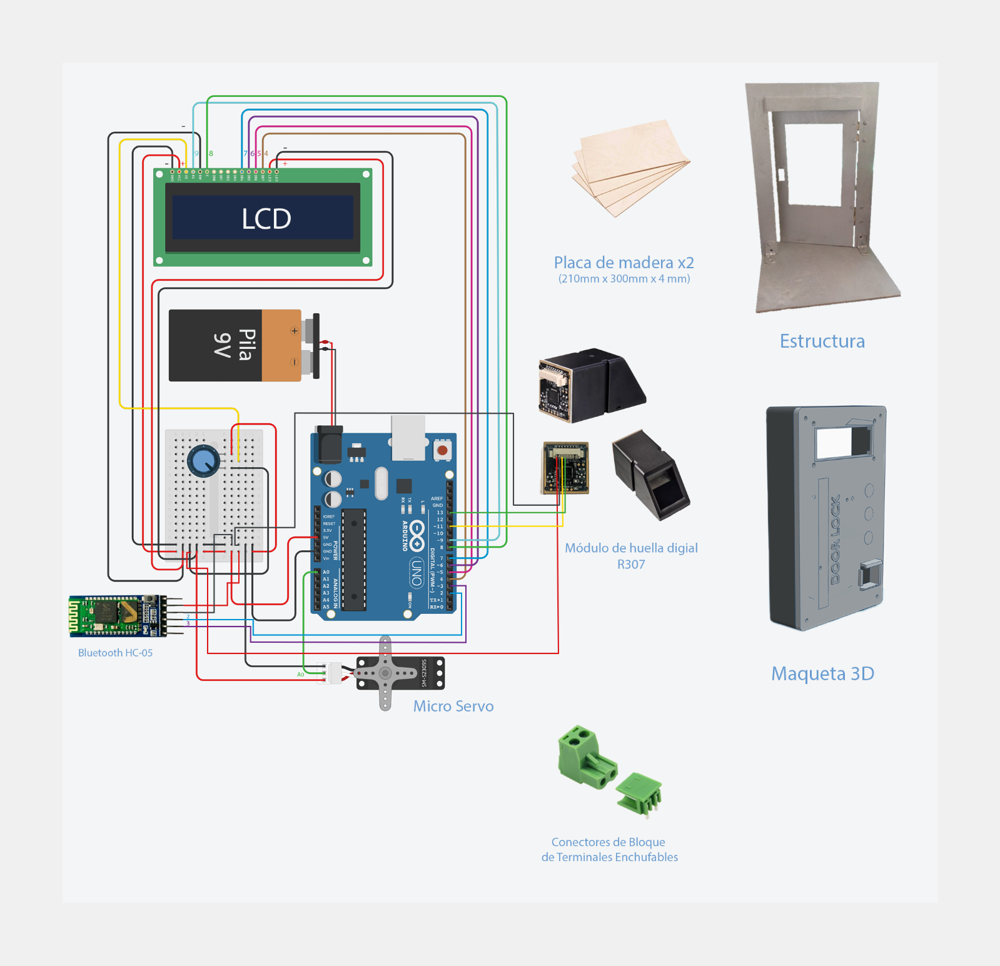

# Access Control System Using Fingerprint and Bluetooth

This project implements an embedded access control system for a door using fingerprint recognition and Bluetooth communication. The system enables the following features:

- **Fingerprint Enrollment**: Users can register new fingerprints in the system.
- **Automatic Door Unlocking**: The door unlocks automatically upon detecting a valid fingerprint.
- **Bluetooth Communication**: The system connects to a mobile device via Bluetooth to receive commands for enrolling fingerprints or unlocking the door.

## System Architecture

The basic architecture of the system is shown below:

## Required Libraries

To run the system, the following Arduino libraries must be installed:

- [Servo](https://www.arduino.cc/en/Reference/Servo)
- [LiquidCrystal](https://www.arduino.cc/reference/en/libraries/liquidcrystal/)
- [SoftwareSerial](https://www.arduino.cc/en/Reference/softwareSerial)
- [Adafruit Fingerprint Sensor Library](https://github.com/adafruit/Adafruit-Fingerprint-Sensor-Library)

## Installation

1. Clone this repository to your local environment.
2. Install the required libraries listed above.
3. Connect the hardware components according to the provided wiring diagram.
4. Upload the code to the Arduino board using the Arduino IDE.

## How It Works

The system operates as follows:

1. **Startup**: When powered on, the LCD displays a waiting message.
2. **Bluetooth Connection**: The system waits for a mobile device to connect via Bluetooth.
3. **Command Reception**: Once connected, the system receives commands from the mobile device. Supported commands include:
   - `1`: Enroll a new fingerprint.
   - `2`: Unlock the door.
   - `3`: Indicate that the mobile device is connected.
4. **Fingerprint Enrollment**: Upon receiving command `1`, the system prompts the user to place their finger on the fingerprint sensor. The fingerprint is captured and stored in memory.
5. **Door Unlocking**: If command `2` is received and a valid fingerprint is detected, the system activates the servo motor to unlock the door.
6. **Mobile Communication**: The system communicates bidirectionally with the mobile application, updating it on system status and triggering appropriate UI screens.

## Additional Notes

- A 9V battery can be added to allow the system to operate autonomously without external power.